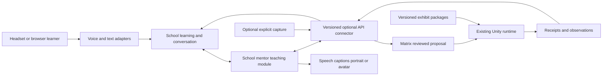

# School of the Ancients: modular spatial learning

Status: proposed implementation plan, September 22, 2026. No new runtime features are claimed by this document.

**Product:** historical AI mentors teach through conversation, prepared interactive exhibits, and responsive visual explanations in AR, VR, and a companion browser. Build on the working Matrix Loading Operator. Preserve the useful ideas and compelling moments of `sota-beta` while improving its implementation.

[Organization Kanban](https://github.com/orgs/School-of-the-Ancients/projects/1) · [Delivery plan](ROADMAP.md) · [API proposal](API-CONTRACT.md) · [Current Matrix guide](https://github.com/School-of-the-Ancients/matrix-loading-operator#readme)

## Module boundaries and independently usable experiences

The architecture is defined by the [module catalog](MODULES.md): Core, Operator, Content, Spatial Presence, Character Body, AI Citizens, School, Human Interface and Integration. These are responsibility and state boundaries, not a requirement for new repositories or microservices. This PRD specifies the School experience assembled from those modules.

School works without Matrix; Matrix works without School or Citizens. School owns learning and historical teaching profiles. Citizens owns resident policy and simulation memory. Core owns authoritative world execution and observations. Operator is the human construction interface to Core. Body supplies finite embodiment without requiring autonomy.

The optional connector uses versioned capabilities, requests and observed receipts. Each module owns its records; a repository containing several modules does not give them shared write authority. See [the API proposal](API-CONTRACT.md), including the unresolved connection between the public School website and local Matrix service.

## Product decisions from this conversation

- Matrix Operator is the spatial foundation to extend. Its scene editing, voice commands, content loading, screenshots, Undo, and save/restore remain useful independently of education.
- The user sees **good ideas in the older sota-beta prototype, implemented poorly; v2 did not deliver the desired improvement**. Preserve those ideas, not the Google live-voice coupling or every implementation detail. A fresh School implementation is a valid option, alongside selective reuse. Prove a small text-first standalone journey before committing to a broad rebuild or migration.
- Everything should be modular: content, lessons, mentor identity, teaching policy, voice, character presentation, scene tools, panels, capture, and world navigation.
- Prepare the required lesson assets in advance for the first experience. The mentor can recombine supported tools and assets when a student asks a follow-up question.
- A PC operator may facilitate while another person wears the headset. This is valuable before networking multiple headsets.
- The long-term setting is a World's Fair of historical mentors and exhibits: visit in VR, or bring an exhibit into a real room in AR.

## People and their tasks

| Person | Task | Success looks like |
| --- | --- | --- |
| Learner | Ask a mentor a question, predict, manipulate, inspect, explain | The mentor responds to what actually happened; progress can be resumed |
| PC facilitator | Start a lesson, help load content, review a scene change, recover a connection | Clear shared status and controls, without editing private JSON during a lesson |
| Lesson creator | Assemble a sourced lesson from existing exhibits and tools | Publish a versioned package that declares its requirements and has a reproducible preview |
| Developer | Add a provider, interaction, presentation, or learning adapter | Implement a documented contract and run its conformance fixtures without replacing the application |

## A first experience we can finish

Start with the existing **Observation and Scale** activity. A proposed first mentor is Galileo, using the earlier Horizon project's persona and assets where suitable. This is a content default to review, not a claim that Galileo authored this particular lesson. Label the character as an AI interpretation and distinguish quotations from generated speech.

1. Choose **Observation and Scale** and AR or virtual-room mode. See readiness in plain language.
2. Select a clear tabletop/floor area. The prepared exhibit loads with known object and lesson identities.
3. The mentor explains the task and asks what happens when each dimension of a block doubles.
4. The learner answers by voice or text, reviews the transcript, and requests the change.
5. Matrix proposes the edit, the user/facilitator applies it, and the runtime acknowledges and reports measured dimensions.
6. The mentor compares the prediction with the observation. A prepared 2×2×2 unit-block arrangement can illustrate volume.
7. The learner asks an unanticipated related question: “What if only the width doubles?” The mentor selects an available demonstration, receives its result, and explains it.
8. Record reflection, save, restart, and restore the correct scene and learning checkpoint.

The existing authored path remains available when the model or speech provider is unavailable. A portrait, captions, and speech can establish the mentor experience before a rigged character. The intended later embodied showcase uses a compatible bundled 3D mentor through the generic NPC adapter.

This activity teaches geometry and measurement. It does not imply mass/physics simulation, unrestricted code generation, or proof of mastery. Participation and assessment are separate outcomes.

## Current foundation versus planned work

Inspected Matrix baseline: [`adde51a`](https://github.com/School-of-the-Ancients/matrix-loading-operator/commit/adde51a6ae6499e255ecdc00970cf8105dc8839a), including merged PRs #27 and #30. These are repository observations, not new live-service or headset tests.

| Area | Existing evidence | Remaining product work |
| --- | --- | --- |
| Matrix runtime | Typed scene edits, stable identities, placement, Rotate/Bob, Undo, saves, PC/headset control | Generic external-session API/status; School owns lesson selection and teaching UI |
| Content | Static prefab export/catalog/download/registration; actual Quest Pro same-session walkthrough | Simpler authoring, startup dependency registration, cached cold-restart acceptance; new content types need adapters |
| Voice | Push-to-talk and transcription into reviewed scene proposals | Explicit answer/question/scene-command routing and mentor speech |
| Learning | Authored scale activity and durable checkpoint/receipt API integrated with v2; desktop loop evidence | Headset learner input, tutor conversation, complete device lesson; target learning implementation to be selected |
| Capture | Explicit virtual image paired with scene state; candidate Quest 3 camera composition | Lesson-turn evidence binding and outstanding hardware acceptance |
| Characters | Historical prompts/FBX props in earlier Horizon repo; generic NPC roadmap exists | Rig/material validation, presentation bindings, finite character actions |
| Reconnect | PR #30 merged; updated service supplies button and correct-port guidance | Exact deployed service and end-to-end recovery acceptance |

Read Matrix's [Learning-Sessions](https://github.com/School-of-the-Ancients/matrix-loading-operator/blob/main/Docs/Learning-Sessions.md), [Visual-Feedback](https://github.com/School-of-the-Ancients/matrix-loading-operator/blob/main/Docs/Visual-Feedback.md), [Content-Packs](https://github.com/School-of-the-Ancients/matrix-loading-operator/blob/main/Docs/Content-Packs.md), and relevant validation reports for evidence boundaries. Quest Pro capture is virtual content/debug geometry, not physical-room pixels. Quest 3 camera code has not established hardware acceptance. Stored room geometry, camera imagery, and live depth/occlusion are separate capabilities.

## Preserve the useful ideas; choose a better School foundation

The first decision gate compares the same user journey in beta, v2, and Matrix: choose a mentor/goal → converse → request a visual → interact → resume a session. Record what works, what feels better in beta, and what is absent or unreliable. Existing beta bugs remain visible; preference for beta is not a claim that all of it is production-ready.

The decision must identify modules to **keep, adapt, repair, or retire**, with a reversible integration slice. Possible outcomes include extending beta through a learning adapter, extracting a useful existing service, or reusing selected v2 contracts. A new repository is justified only by independent ownership/build/release needs. The user is open to starting School fresh; the decision should follow the demonstrated slice, not the age/name of the repository alone. Matrix stays the existing independent product.

Matrix's current `learning.py` integration and v2 durable API are reusable evidence. Their existence does not mandate v2 as the future application. After selection, one learning implementation owns session and assessment state; adapters must not create competing progress stores. Existing saved records need explicit versioned conversion or continued support before any backend migration.

## Text-first School core; voice is an adapter

The [original beta rebuild issue](https://github.com/School-of-the-Ancients/sota-beta/issues/252) already calls for a text-model core with STT/TTS layered on top, separate visual generation, and explanation/example before guided practice and Socratic questioning. This is an architectural requirement to preserve, not a commitment to historical model names or a particular provider.

School owns durable turns, mentor/lesson state, source context and validated tool requests. A provider's live audio session must not be the only place the lesson exists. Voice, text input, model inference, artifact generation and Matrix access are independent adapters. Optional realtime speech must use the same canonical turn/tool/record contract. The standalone acceptance journey must work with voice disabled and Matrix disconnected. See [the standalone core slice](https://github.com/School-of-the-Ancients/school-of-the-ancients-roadmap/issues/13).

## Module architecture

The following table details School-facing submodules/adapters within the canonical [module catalog](MODULES.md). It does not collapse Citizens policy into Core or require the whole ecosystem for a lesson.

Start with modules in existing repositories/processes. Modularity does not require a service, repository, or package for every feature. Extract deployment units only when useful and document why.

| Module | Responsibility | Boundary and fallback |
| --- | --- | --- |
| School learning domain and client adapter | Lesson/session lifecycle, responses, checkpoint references, assessment interface | School owns learning; its selected implementation sits behind a versioned contract; authored fixture works without a live model |
| Mentor identity | Persona, historical framing, source set, voice/presentation references | Separate from teaching policy, learner records, and generic NPC simulation memory |
| Mentor teaching/orchestration | Dialogue, next question, explanation, typed demonstration requests | Cannot directly mutate scene or award mastery; consumes observed evidence |
| Matrix scene tools | Proposals, review, commands, actual runtime receipts, Undo | Existing executor remains scene authority; unknown tools unavailable |
| Optional cross-product connector | School answers/turns correlated with Matrix selections, manipulation outcomes and captures | Each product keeps authority over its domain; bounded retries and no third canonical progress store |
| Content/catalog adapter | Discovery, exact versions, validation, cache, runtime installation | Reuse #9/#21/#28; unavailable content is explicit; no arbitrary downloaded C# |
| Exhibit package | Lesson reference, start scene, source refs, capability/content requirements | Reuse supported assets; fail preflight before partially replacing a scene |
| Voice adapters | STT, transcript correction, TTS, playback/interrupt | Captions/text remain available; provider keys stay on the server/PC |
| Mentor presentation | Portrait, captions, optional avatar/lip-sync/gesture bindings | Missing avatar does not break dialogue; consume #13A/#14 for finite character actions |
| Visual artifact renderer | Diagrams, controls, interactive lesson panels | Native, browser, or texture adapters selected by measured prototype; renderer-neutral events |
| Observation/capture | Precise scene observations plus optional explicit image | Honest provenance, timestamps, supported devices, stale-context handling |
| Experiment capability | One tested parameterized teaching interaction | Deterministic/measured outcomes, bounded parameters, reset; no fabricated physics results |
| World navigation | Exhibit discovery, VR pavilion/AR placement, return/resume | No mandatory NPC autonomy or multiuser networking |
| School adaptive modules | Course sequencing and learner knowledge | School-owned records; independent of resident memory |
| AI Citizens module | Resident needs, memory, schedules, planning and social behavior | Separate module consuming world/body contracts; optional for teaching |
| Shared-session adapter | Session coordination and participant identity | Optional integration; no merged learner records |

### Required contract properties

- Modules declare stable IDs, schema/API versions, required/optional dependencies, supported platforms, initialization/disposal, availability, and reasons for being unavailable. Matrix extends its runtime/provider capability registry; School owns its lesson/mentor requirements. The connector negotiates them without a shared application registry or synchronized deployment requirement.
- A lesson declares exact asset versions/digests, supported tools, source/mentor/prompt versions, expected observations, and optional enrichments. Required capability absence blocks launch with a useful remedy; optional absence degrades visibly.
- Lifecycle events carry session/turn/request/event IDs and relevant versions. Repeated/out-of-order delivery cannot duplicate a response, spawn, grade, or checkpoint fork.
- Authored scene edits, observed simulation changes, and learning revisions remain distinct. Use #13A's ownership contract when actions/animation require it; do not invent a second executor.
- One writer owns each persisted record/property. Store durable references and outcomes; omit transient callbacks/audio buffers/navigation internals from saves.
- Every adapter has deterministic fixtures and conformance checks, including optional-module removal and version mismatch. A fake adapter is test evidence, not a live integration.
- Historical mentor identity maps to generic NPC identity through an adapter; do not independently fork character-card definitions. Learner knowledge is not NPC memory.

### Action and evidence flow

`learner input → mentor request → proposal → approval → dispatch → acknowledged / failed / unconfirmed → observed result → mentor response`

The current explicit review/Apply flow is the default. A later authored demonstration policy may authorize a finite allowlist, but it must be separately specified and retain Stop/Undo; a lesson start does not silently authorize arbitrary autonomous edits. Late responses after load, cancel, room replacement, or session change must not mutate a new session. Retain and reconcile receipts for already-dispatched operations under their original identity; a disconnect does not prove rollback or erase an observed effect.

Images supplement exact state. Never say the mentor “sees what the learner sees” without qualifying capture mode, field of view, time, and actual contents. Capturing alone does not invoke a model. Physical-camera permission or denial must not silently change a virtual lesson into a camera-dependent one.

## Interactive explanations and content growth

Use a graduated response to an unexpected student question:

1. Re-explain or ask a diagnostic question using the current lesson's grounded sources.
2. Recombine already available objects, transforms, diagrams, and interaction parameters.
3. Offer an approved compatible cached/catalog asset through #28, with visible preparation/registration status and fresh placement review.
4. If a new compiled capability is needed, explain the limit and queue creator/developer work; do not pretend an asset URL supplies a runnable script.

The learner should see **Choose lesson → Prepare → Start / Resume**, not provider manifests or Unity export stages. Creators get a separate guided **Publish to Matrix** workflow through #28, with preview, compatibility report, exact exported package, and installation acknowledgment. Advanced configuration remains available outside the learner path.

Marinara's character/visual-artifact design inspires generated explanations; it is not a verified drop-in Quest HTML runtime. Its current sanitized chat rendering does not by itself establish arbitrary JavaScript execution or tutor feedback from widgets. Prototype one event-producing lesson panel before selecting a renderer. Ryo Suzuki's projects inspire equation manipulation, parameter experiments, and teachable physical interactions; implement concrete capabilities rather than assuming the papers provide a universal engine.

## Delivery and acceptance

| Phase | Visible result | Exit gate |
| --- | --- | --- |
| S0 — Preserve and stabilize | Beta comparison, product/API decisions, dependable Matrix setup/recovery | Reviewed reuse decision; real School deployment → paired local Matrix → receipt round trip; recorded baseline and outstanding hardware limits |
| S1 — Standalone School and authored integration | A text-first School journey works independently; headset learner completes Observation and Scale with durable state | Actual School deployment/connector; predict → manipulate → observe → reflect → restart/restore, plus failure cases |
| S2 — Historical mentor | Mentor discusses actual student actions and handles a related surprise question | Live-model evidence; interruptible speech/captions; same learning record; optional avatar separate |
| S3 — Richer teaching tools | One responsive panel and one tested math/science interaction; easier content preparation | Manipulation feeds tutor evidence; creator publishes a compatible exhibit without manual provider JSON |
| S4 — World's Fair | Browse multiple exhibits; enter VR pavilion or place AR exhibit; PC facilitation | At least two exhibits use common modules; save/resume and return navigation work |
| S5 — Adaptive/shared expansion | Existing curriculum/memory/materials features connected; optional multiheadset teaching | Per-module research/acceptance gates; no speculative networking or mastery claims |

Detailed issue dependencies and status rules live in the [delivery plan](ROADMAP.md). These phases are outcome ordering, not promised dates or a requirement to finish every issue in one phase before an independent adapter can start.

### Evidence required before claiming a milestone

- Contract tests: version mismatches, unavailable optional modules, duplicate/out-of-order events, cancellation, failed/unconfirmed commands, stale capture, and interrupted restore.
- Integration: actual selected learning implementation + Matrix PC service + built desktop player. Preserve existing proposal/Undo/content/save workflows.
- Live mentor: correct and incorrect answers, misconception, unexpected supported question, unsupported request, missing evidence, model outage. No success claim before a receipt/measurement; no invented mastery update.
- Actual device: voice/input, readable panels/captions, focus/tracking loss, room alignment, recovery, resource/frame-time measurements, and saved lesson restore on the exact build.
- Content: app restart → upstream provider unavailable → cached dependencies validated/registered → saved scene/lesson restored while the PC service remains reachable.
- Usability: formative trial with at least three people unfamiliar with the setup. Record assistance, failure points, launch time, turn latency, and whether they complete the lesson without editing JSON/ports. Set performance budgets from baseline measurements; do not invent a pass threshold after the test.
- Learning: separate participation, explanation quality, and an independently scored transfer question. A small pilot is evidence for iteration, not proof of educational efficacy.

Desktop and Quest Pro can validate early lesson work. Quest 3 is the primary final room-aware target; #22A gates its room acceptance. #26 gates physical-image-dependent features only. Neither generic NPC navigation (#22B), needs, nor GOAP gates the first lesson.

## Optional AI Citizens module

An exploratory AI Citizens module direction is a persistent community of distinct AI residents in Matrix. Residents may develop personal goals and reusable skills, encounter artifacts left by others, cooperate or contend for objects, and interact with human visitors. This belongs to the AI Citizens module, initially hosted in the Matrix repository under [Matrix NPC roadmap #29](https://github.com/School-of-the-Ancients/matrix-loading-operator/issues/29). School may later use an inhabited exhibit, but its mentor dialogue, curriculum and learner progress remain School-owned. It does not gate the first prepared lesson.

The proposed first slice is an **isolated, deterministic fixture** with two residents, one validated shared artifact, one object interaction, a conflicting resource, observed outcomes, save/restore and replay. The runtime owns legal actions, state changes and receipts. Skills and artifacts are typed, bounded data with provenance and validator results. Residents may share them only through supported world capabilities. A finite state graph owns legal transitions and priority interrupts. At optional choice points, compare fixed priority, seeded utility and Jev over the same legal candidates; observed execution remains authoritative. Use utility when it performs as well as Jev or when the model is unavailable.

Character motion can start with licensed clips, while generated motion remains an authoring experiment. A slower planning layer with faster local choices is another hypothesis for the optional community; it must be measured against scripted decisions and runtime budgets. [Source and workflow notes](RESEARCH-AI-NPC-COMMUNITY.md) identify Quaternius, Defold, Rigipo, stick-figure storyboards and the reported Astra/Jev RTS demonstration.

[Odyssey's Agora-2](https://odyssey.systems/introducing-agora-2) is an optional research comparator for shared multi-agent world state and generated views. Any learned-world experiment is assessed separately from Matrix's authoritative actions, receipts and first NPC acceptance; no engine or rendering change is selected by this reference.

A later human-facing test is an inhabited quest hub: a resident may remember a recent interaction, react with authored personality, wander briefly within a bounded area and return. An authoritative quest service keeps required quests discoverable and grants progress/rewards; grounded dialogue and optional model choices cannot change that contract. [Halo: Combat Evolved's finite-state AI and current NPC examples](RESEARCH-AI-NPC-COMMUNITY.md) provide baseline and context.

Acceptance for a community claim requires a comparison with scripted and isolated-agent baselines under matched seeds and budgets, plus recorded task success, validated skill reuse, artifact lineage, invalid actions, latency/cost, failure recovery and replay. PC and Quest 3 performance each need direct evidence. [Research synthesis and primary links](RESEARCH-AI-NPC-COMMUNITY.md), [community evaluation #14](https://github.com/School-of-the-Ancients/school-of-the-ancients-roadmap/issues/14) and [Jev decision study #15](https://github.com/School-of-the-Ancients/school-of-the-ancients-roadmap/issues/15) define the research gates; any accepted runtime implementation is scoped in existing Matrix issues.

## Longer-term scope and exclusions

The full direction includes multiple mentors/exhibits, reusable authored and adaptive curricula, learner knowledge and uploaded course material, generated diagrams/backgrounds, shared teaching, and optional believable characters. Existing beta/v2/NPC issues own those capabilities where they fit; adoption follows the reuse decision.

The first product does not require a Unity replacement, arbitrary runtime code, autonomous Asset Store acquisition, a new content marketplace, full NPC society, continuous camera streaming, or a multiplayer backend. New engine capabilities still require application development/builds. Compatible content and lesson data should be publishable without rebuilding the player once their required capabilities ship.

## Repositories and source lineage

- [Matrix Loading Operator](https://github.com/School-of-the-Ancients/matrix-loading-operator): independent spatial runtime/product; its own generic API and capability implementation issues remain there.
- [sota-beta](https://github.com/School-of-the-Ancients/sota-beta): prototype ideas/experience reference and candidate code to reuse selectively; inspect existing mentor, voice, visuals, quests, and persistence before replacing anything.
- [sota-v2](https://github.com/School-of-the-Ancients/sota-v2): reusable candidate code/contracts; current Matrix learning adapter integrates its [Operator API](https://github.com/School-of-the-Ancients/sota-v2/blob/main/docs/OPERATOR_API.md). Its [beta experience spec](https://github.com/School-of-the-Ancients/sota-v2/blob/main/docs/FRONTEND_BETA_EXPERIENCE_SPEC.md) is research input, not a renewed mandate to rebuild beta.
- [Earlier Horizon VR project](https://github.com/School-of-the-Ancients/school-of-the-ancients-vr): Cosmos-inspired fair, mentor prompts, props and models; Horizon TypeScript requires adaptation and FBX compatibility remains to be checked.
- [School website](https://schooloftheancients.com/): product vision; [Marinara Engine](https://github.com/Pasta-Devs/Marinara-Engine): character and visual-artifact inspiration.
- [Augmented Math](https://ryosuzuki.org/augmented-math/), [Augmented Physics](https://ryosuzuki.org/augmented-physics/), [Teachable Reality](https://ryosuzuki.org/teachable-reality/), [Programmable Reality](https://ryosuzuki.org/programmable-reality/): research/design references, not claimed installed dependencies.

## Decisions to settle during implementation

The early reuse audit decides the learning module home and integration seam with the user, using a demonstrated journey. The first lesson defaults to Observation and Scale; mentor identity, voice, and style remain replaceable data. Renderer choice follows a device prototype. Quest 3 access and coursework dates/reuse approval remain external constraints to verify through #24. Repository issue status or merged code never substitutes for runtime/device acceptance.
